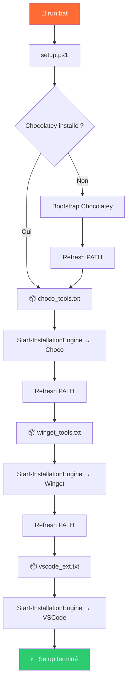

<p align="center">
  
  
  
  
  
</p>

<p align="center">
  <strong>📼 The Automation Ledger — DevOps & Cloud Series</strong><br/>
  <sub>Episode #1 · par <strong>Ulrich Steve Noumsi</strong> · Ingénieur DevSecOps / Cloud Automation</sub>
</p>

---

# 🖥️ Workstation As Code

> **Provisionner automatiquement un poste de travail Windows complet en une seule commande.**

Workstation As Code (WaC) applique le principe **Infrastructure as Code** à la configuration d'un poste développeur/DevOps. Au lieu de cliquer dans des assistants d'installation pendant des heures, vous déclarez vos outils dans des fichiers texte et le script s'occupe du reste.

---

## ✨ Fonctionnalités

| Fonctionnalité | Description |
|---|---|
| 🎯 **Data-driven** | Les listes de paquets sont externalisées dans `data/` — pas besoin de toucher au script |
| 📦 **Multi-gestionnaire** | Supporte **Chocolatey**, **Winget** et les **extensions VS Code** |
| 📌 **Version pinning** | Possibilité de figer une version précise (`kubernetes-cli:1.31.2`) ou de rester sur `latest` |
| 🪵 **Logging horodaté** | Chaque exécution génère un fichier de log dans `logs/` |
| 🔄 **Session refresh** | Recharge automatiquement le `PATH` après chaque phase d'installation |
| 🛡️ **Idempotent** | Les gestionnaires de paquets gèrent nativement la ré-exécution sans casser l'existant |
| ⚡ **Bootstrap automatique** | Installe Chocolatey automatiquement s'il n'est pas déjà présent |

---

## 📂 Arborescence du projet

```
workstation-as-code/
├── 📄 README.md                  # Ce fichier
├── 📄 LICENSE                    # Licence MIT
├── 📄 .gitignore                 # Exclusions Git
├── 🔧 setup.ps1                  # Script principal d'orchestration
├── 🚀 run.bat                    # Lanceur en double-clic (admin)
├── 📁 data/
│   ├── choco_tools.txt           # Paquets Chocolatey
│   ├── winget_tools.txt          # Paquets Winget
│   └── vscode_ext.txt            # Extensions VS Code
└── 📁 logs/
    └── setup_YYYYMMDD_HHmm.log  # Logs horodatés (auto-générés)
```

---

## 🚀 Démarrage rapide

### Prérequis

- **Windows 10/11** (64-bit)
- **PowerShell 5.1+** (inclus avec Windows)
- **Droits administrateur** (nécessaire pour Chocolatey et Winget)
- **Winget** pré-installé (inclus avec Windows 11, disponible via le Microsoft Store sur Windows 10)

### Installation

1. **Cloner le dépôt**
   ```powershell
   git clone https://github.com/ulrich-sun/workstation-as-code.git
   cd workstation-as-code
   ```

2. **Personnaliser vos outils** — Éditez les fichiers dans `data/` selon vos besoins (voir section [Configuration](#-configuration))

3. **Lancer le provisionnement** — Double-cliquez sur `run.bat` ou exécutez :
   ```powershell
   # PowerShell en tant qu'administrateur
   .\setup.ps1
   ```

---

## ⚙️ Configuration

### Format des fichiers de données

Chaque fichier suit le format `identifiant:version` — une entrée par ligne.

```
# Les commentaires commencent par #
nom-du-paquet:1.2.3        # Version figée
nom-du-paquet:latest        # Dernière version
nom-du-paquet:              # Équivalent à latest
nom-du-paquet               # Équivalent à latest
```

### `data/choco_tools.txt` — Paquets Chocolatey

Outils CLI et DevOps installés via [Chocolatey](https://chocolatey.org/) :

```
# Infrastructure as Code
terraform:
terragrunt:latest

# Containers & Orchestration
kubernetes-cli:1.31.2
kubernetes-helm:4.1.3

# Cloud CLI
azure-cli:latest
awscli:latest
```

### `data/winget_tools.txt` — Applications Winget

Applications GUI installées via [Winget](https://learn.microsoft.com/en-us/windows/package-manager/) :

```
# Base Professional Apps
Microsoft.VisualStudioCode:latest
Vivaldi.Vivaldi:latest
Git.Git:2.54.0
Slack.Slack:latest
```

### `data/vscode_ext.txt` — Extensions VS Code

Extensions installées via `code --install-extension` :

```
ms-vscode.PowerShell
ms-azuretools.vscode-docker
HashiCorp.terraform
```

> 💡 **Astuce** : Pour exporter vos extensions actuelles, exécutez :
> ```powershell
> code --list-extensions | Out-File data/vscode_ext.txt
> ```

---

## 🏗️ Architecture



### Moteur d'installation (`Start-InstallationEngine`)

Le cœur du script est une fonction générique qui :

1. Lit un fichier de données ligne par ligne
2. Ignore les commentaires (`#`) et les lignes vides
3. Parse le format `identifiant:version`
4. Délègue l'installation au gestionnaire approprié (`Choco`, `Winget`, `VSCode`)
5. Journalise chaque action avec horodatage

---

## 📋 Logs

Les logs sont automatiquement générés dans `logs/` avec le format :

```
logs/setup_20260422_2233.log
```

Exemple de contenu :

```
[22:33:01] === STARTING INFRASTRUCTURE SETUP ===
[22:33:01] --- Module: Choco ---
[22:33:01] Processing: terraform (Target Version: latest)
[22:33:04] Processing: terragrunt (Target Version: latest)
[22:35:13] === SETUP COMPLETED SUCCESSFULLY ===
```

---

## 🤝 Contribuer

Les contributions sont les bienvenues ! Voici comment participer :

1. **Forkez** le dépôt
2. Créez une branche feature : `git checkout -b feature/mon-ajout`
3. Commitez vos modifications : `git commit -m "feat: ajouter support npm global packages"`
4. Poussez : `git push origin feature/mon-ajout`
5. Ouvrez une **Pull Request**

### Conventions de commit

Ce projet utilise [Conventional Commits](https://www.conventionalcommits.org/) :

| Préfixe | Usage |
|---|---|
| `feat:` | Nouvelle fonctionnalité |
| `fix:` | Correction de bug |
| `docs:` | Documentation |
| `refactor:` | Refactoring sans changement fonctionnel |
| `chore:` | Maintenance (CI, dépendances, etc.) |

---

## 📜 Licence

Ce projet est distribué sous la licence **MIT**. Voir le fichier [LICENSE](LICENSE) pour plus de détails.

---

## 📼 The Automation Ledger — DevSecOps & Cloud Series

> *Une bibliothèque vivante de frameworks et projets couvrant l'ensemble du cycle DevSecOps — de la workstation jusqu'au monitoring de production.*

### Les 8 piliers de la série

| Pilier | Thèmes couverts |
|---|---|
| 🖥️ **Workstation as Code** | Provisionnement, dotfiles, outils DevSecOps |
| 🏗️ **Infrastructure as Code** | Terraform, Terragrunt, Packer, Pulumi |
| 🔐 **Security / DevSecOps** | Trivy, Checkov, tfsec, Vault, SOPS, SBOM, cosign |
| ⚙️ **CI/CD Pipelines** | GitHub Actions, GitLab CI, ArgoCD, Flux (GitOps) |
| 📦 **Cloud Native / Kubernetes** | Helm, Kustomize, Pod Security, Network Policies |
| 📊 **Monitoring & Observabilité** | Prometheus, Grafana, Loki, Alerting, SLO/SLA |
| 📝 **Compliance as Code** | OPA/Gatekeeper, audit trails, CIS Benchmarks |
| 🤖 **Automation Engines** | PowerShell, Python, runbooks, auto-remediation |

### Épisodes

| # | Épisode | Pilier | Statut |
|---|---|---|---|
| **01** | **Workstation As Code** ← *vous êtes ici* | 🖥️ Workstation | ✅ Publié |
| 02 | Terraform + Terragrunt — Structure multi-env | 🏗️ IaC | 🔜 Planifié |
| 03 | Pipeline CI/CD complet avec GitHub Actions | ⚙️ CI/CD | 🔜 Planifié |
| 04 | Scanner de sécurité IaC avec Trivy + Checkov | 🔐 Security | 🔜 Planifié |
| 05 | Stack Monitoring — Prometheus + Grafana + Loki | 📊 Monitoring | 🔜 Planifié |
| 06 | GitOps avec ArgoCD sur Kubernetes | 📦 Cloud Native | 🔜 Planifié |
| 07 | Gestion des secrets — HashiCorp Vault + SOPS | 🔐 Security | 🔜 Planifié |
| 08 | Compliance as Code avec OPA + CIS Benchmarks | 📝 Compliance | 🔜 Planifié |

🎬 **Suivre la série** : [YouTube — The Automation Ledger](https://youtu.be/kPrKhGUD82g)

---

## 👤 Auteur

**Ulrich Steve Noumsi** — *Ingénieur DevSecOps / Cloud Automation *

<p>
  <a href="https://github.com/ulrich-sun"></a>
  <a href="https://ca.linkedin.com/in/ulrich-steve-noumsi"></a>
  <a href="https://www.youtube.com/@SUNDATACONSULTING"></a>
</p>

---

<p align="center">
  <i>⭐ Si ce projet vous est utile, laissez une étoile sur GitHub !</i><br/>
  <sub>Part of <strong>The Automation Ledger</strong> · DevOps & Cloud Series by Ulrich Steve Noumsi</sub>
</p>
